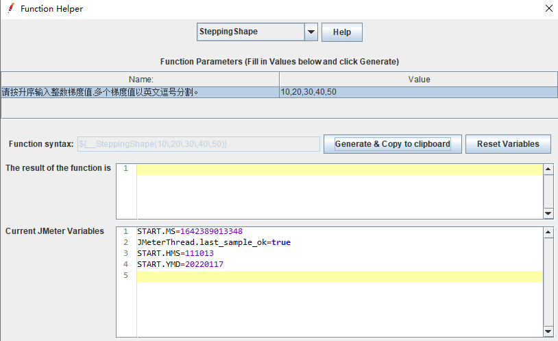
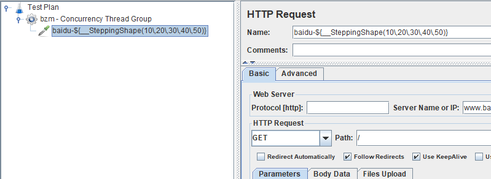
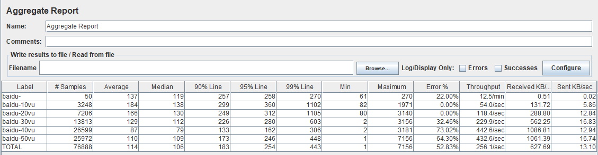
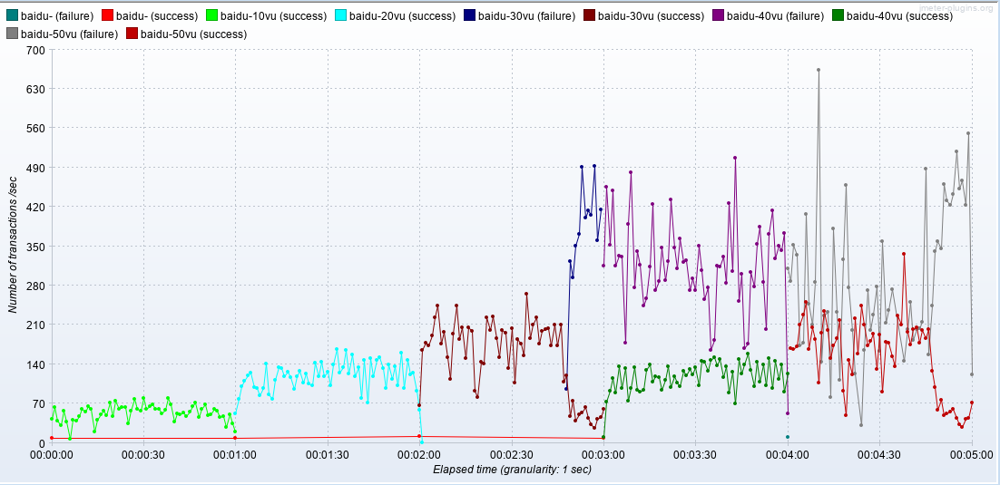

# jmeter-custom-functions

#### 介绍

jmeter-custom-functions 定制函数。
1. __SteppingShape函数用来统计每个并发梯度下的吞吐量
2. ...
#### 安装教程

1.  git clone https://gitee.com/LeeBaul/jmeter-custom-functions.git
2.  mvn package
3.  copy jmeter-custom-functions.xxx.jar to ${JMETER_HOME}/lib/ext

#### 使用说明

1.   **__SteppingShape函数** 

2.   **__效果图**

#### 参与贡献

1.  Fork 本仓库
2.  新建 Feat_xxx 分支
3.  提交代码
4.  新建 Pull Request

#### 我的公众号

